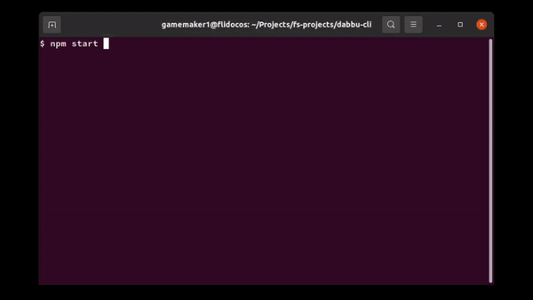

# Dabbu Server

A unified API platform to access your emails, photos, and chats as simple files and folders.

## Intro

Tired of having your files and folders randomly scattered about online with multiple companies from Google to Dropbox? Want to access your Google Drive or OneDrive as fast and easily as your hard drive? Well, that's exactly what we have tried doing with Dabbu. We'll let this GIF do the talking:



What you just saw there was Dabbu CLI in action - a simple program in javascript that leverages the Dabbu API to bring your files and folders at your fingertips from all over the web.

**This repo contains the server application that handles API calls from clients. The source for the CLI app demoed in the GIF above can be found [here](https://github.com/gamemaker1/dabbu-cli).**

## Getting started

The installation can be done manually on Linux, MacOS, Android (Requires Termux) and Windows.

- First, download the proper executable for your platform from the [Releases page](https://github.com/gamemaker1/dabbu-server/releases). (Caution: releases may not work on certain versions of Android, depending on the manafacturer and version.)

- On Windows, simply double click on the file to run it.

- On Linux/MacOS, run the following command in a terminal (assuming you have downloaded the executable to your Downloads folder):

  - On MacOS:

    ```sh
    $ ~/Downloads/dabbu-server-macos
    ```

  - On Linux:

    ```sh
    $ ~/Downloads/dabbu-server-linux
    ```

- Your server is now running! To check, go to http://localhost:8080/. You will see the text `Dabbu Server running on port 8080` on the page. If not, try running the server again or check if you have missed a step. If the problem persists, post a message on [Github discussions](https://github.com/gamemaker1/dabbu-server/discussions/categories/q-a) asking for help. We'll only be glad to help you :)

## Updating the server

To update the server, simply download the new version from the [Releases page](https://github.com/gamemaker1/dabbu-server/releases).

## Installing clients to call the Dabbu API

Here is a list of clients that have been made to interact with the Dabbu API:

- [**Dabbu CLI**](https://github.com/gamemaker1/dabbu-cli) - A CLI that leverages the Dabbu API and neatly retrieves your files and folders scattered online.

## Supported Providers

- [**Hard drive**](./docs/modules/hard_drive.md)
- [**Google drive**](./docs/modules/google_drive.md)
- [**Gmail**](./docs/modules/gmail.md)
- [**One drive**](./docs/modules/one_drive.md)

_And more to come...!_

### Creating a new provider

**Note: If you want to create a new provider, please file an issue using the `New provider` template [here](https://github.com/gamemaker1/dabbu-server/issues/new/choose). This is only to let us know that you want to work on the provider and how you plan to go about it. Also, if you need any help on the code, please do ask on [this](https://github.com/gamemaker1/dabbu-server/discussions/categories/want-to-contribute) Github discussion. We will only be glad to help :)**

## Docs

The API documentation is in the file [docs/APIs.md](./docs/APIs.md).

The code structure is documented in the file [docs/Code.md](./docs/Code.md).

## Issues and pull requests

You can contribute to Dabbu by reporting bugs, fixing bugs, adding features, and spreading the word! If you want to report a bug, create an issue by clicking [here](https://github.com/gamemaker1/dabbu-server/issues/new/choose). While creating an issue, try to follow the Bug report or Feature request template.

To contribute code, have a look at [CONTRIBUTING.md](./CONTRIBUTING.md).

## Legal stuff

### License - GNU GPL v3

Dabbu Server - a unified API to retrieve your files and folders stored online

Copyright (C) 2021 gamemaker1

This program is free software: you can redistribute it and/or modify
it under the terms of the GNU General Public License as published by
the Free Software Foundation, either version 3 of the License, or
(at your option) any later version.

This program is distributed in the hope that it will be useful,
but WITHOUT ANY WARRANTY; without even the implied warranty of
MERCHANTABILITY or FITNESS FOR A PARTICULAR PURPOSE. See the
GNU General Public License for more details.

You should have received a copy of the GNU General Public License
along with this program. If not, see <https://www.gnu.org/licenses/>.
